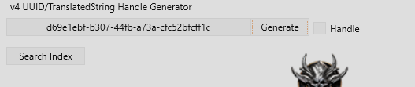
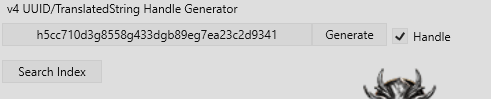
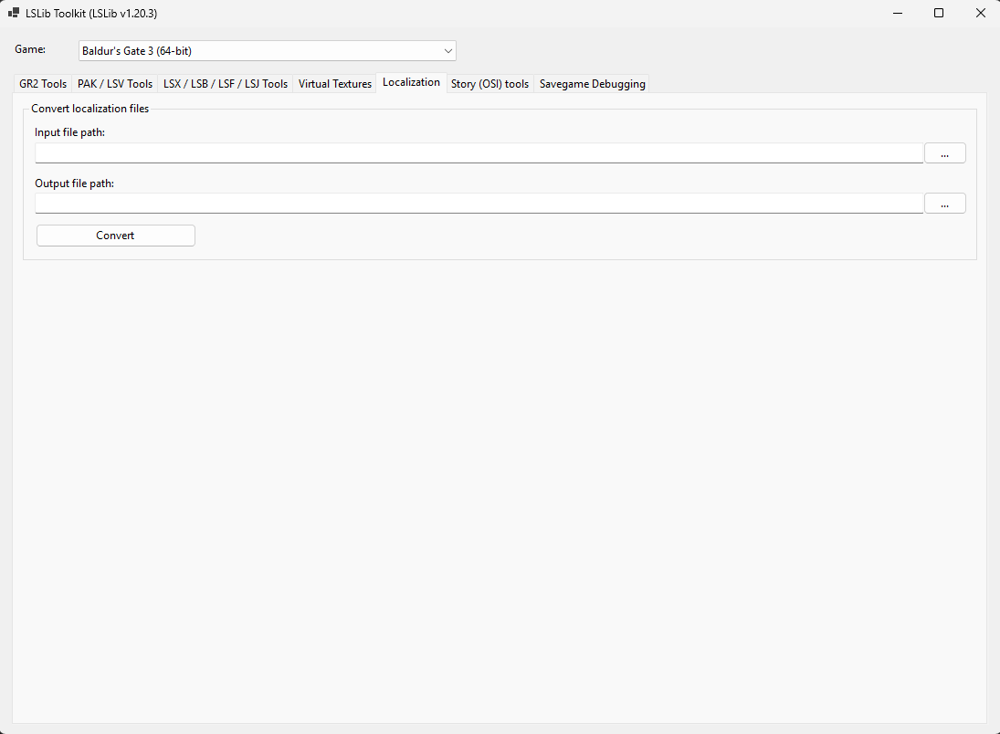
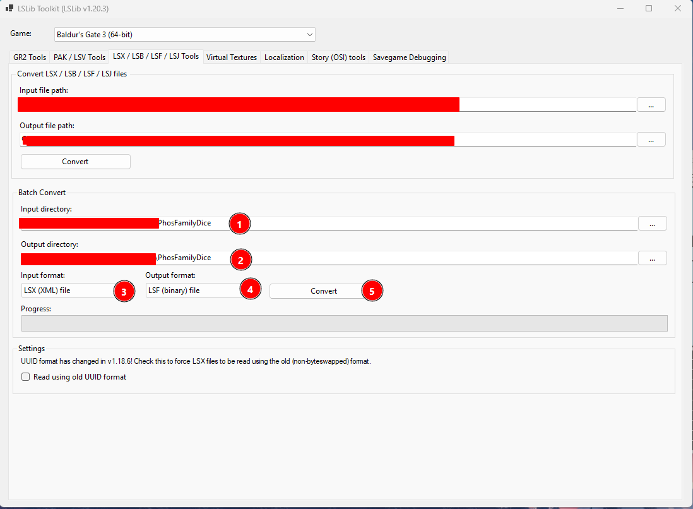
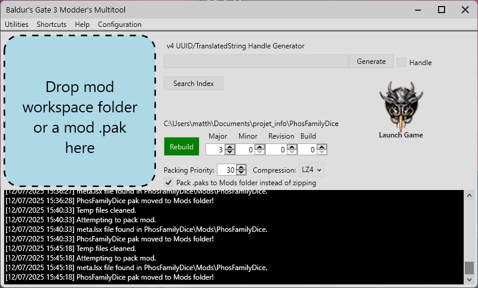

# PhosFamilyDice - Mod Baldur's Gate 3

Ce mod ajoute deux fonctionnalités principales :
- **PhosDice** : Un set de textures personnalisées pour les dés d20
- **PhosLuckyDice** : Un nouvel item permettant d'obtenir un boost passif de jet de dé (si équipé)

---

## Fonctionnalités

### PhosDice - Textures de Dés Personnalisées

Un set complet de textures pour le dé d20 incluant :
- `d20.DDS` - Texture principale du dé
- `d20_1.DDS` à `d20_20.DDS` - Textures pour chaque face (1-20)
- `d20_faceCover.DDS` - Texture de couverture des faces
- `single_roll.DDS` - Animation de lancer simple
- `double_roll_1.DDS` / `double_roll_2.DDS` - Animations de double lancer

### PhosLuckyDice - Dé Porte-Bonheur

Un objet légendaire avec les caractéristiques suivantes :
- **Rareté** : Légendaire
- **Poids** : 0.5
- **Valeur** : 18000 or
- **Effets** :
  - `+2` aux jets de compétences (SkillCheck)
  - `+1` aux jets d'attaque (Attack)
  - `+1` aux jets de sauvegarde (SavingThrow)


## Structure du Mod

```
PhosFamilyDice/
├── Mods/
│   └── PhosFamilyDice/
│       ├── meta.lsx                    # Métadonnées du mod
│       ├── GUI/
│       │   └── Assets/DiceSets/
│       │       └── PhosDice/           # Textures des dés
│       │           ├── d20.DDS
│       │           ├── d20_1.DDS ... d20_20.DDS
│       │           ├── d20_faceCover.DDS
│       │           ├── single_roll.DDS
│       │           └── double_roll_*.DDS
│       └── Localization/
│           ├── English/PhosFamilyDice.xml
│           └── French/PhosFamilyDice.xml
├── Public/
│   ├── Game/GUI/Assets/                # Icônes de l'objet
│   │   ├── ControllerUIIcons/items_png/
│   │   │   └── Item_LOOT_PhosLuckyDice_Icon.DDS
│   │   └── Tooltips/ItemIcons/
│   │       └── Item_LOOT_PhosLuckyDice_Icon.DDS
│   └── PhosFamilyDice/
│       ├── Assets/
│       │   ├── Item_LOOT_PhosLuckyDice_Model.GR2   # Modèle 3D compilé
│       │   ├── Item_LOOT_PhosLuckyDice_Model.xml   # Définition du modèle 3D
│       │   └── Textures/Icons/
│       │       └── PhosFamilyDice_Icons.dds        # Icône inventaire (atlas)
│       ├── Content/UI/[PAK]_UI/
│       │   └── _merged.lsx             # TextureBank + VisualBank
│       ├── CustomDice/CustomDice.lsx   # Définition du set de dés
│       ├── DLC/DLC.lsx                 # Définition du DLC
│       ├── GUI/Icons_Items.lsx         # TextureAtlas des icônes
│       ├── RootTemplates/merged.lsx    # Template de l'objet
│       └── Stats/Generated/
│           ├── TreasureTable.txt       # Table de loot
│           └── Data/Armor.txt          # Stats de l'objet
└── summon                              # Script pour invoquer l'objet
```

---

## Import des Textures

### Prérequis

- **LSLib Toolkit** pour la compilation du mod et des fichier `*.lsx`
- **BG3 Modder's Multitool**
- **NVIDIA Texture Tools** ou équivalent pour exporter en DDS

### Textures PhosDice (Set de Dés)

Les textures de dés se trouvent dans :
```
Mods/PhosFamilyDice/GUI/Assets/DiceSets/PhosDice/
```

#### Format des fichiers

| Fichier | Dimension | Description |
|---------|-----------|-------------|
| `d20.DDS` | 512x512 | Texture principale du dé |
| `d20_1.DDS` à `d20_20.DDS` | 128x128 | Texture de chaque face |
| `d20_faceCover.DDS` | 128x128 | Couverture des faces |
| `single_roll.DDS` | 256x256 | Animation lancer simple |
| `double_roll_1/2.DDS` | 256x256 | Animation double lancer |

Il nous faut ensuite ajouter des fichiers de description pour lier les textures du dé au jeu:

- `Public\PhosFamilyDice\CustomDice\CustomDice.lsx`: dans ce fichier on peut décrire le dé avec un nom, une description...
- `Public\PhosFamilyDice\DLC\DLC.lsx`: dans ce fichier on peut définir un nouveau contenu de jeu

### Icône PhosLuckyDice (Item)

L'icône de l'objet se trouve dans trois emplacements :
| Fichier | Dimension | Description |
|---------|-----------|-------------|
| `Public\Game\GUI\Assets\ControllerUIIcons\items_png\Item_LOOT_PhosLuckyDice_Icon.DDS` | 144x144 | Il est vu au même endroit que pour l'item ci-dessous mais est affiché uniquement pour les joueurs mannettes |
| `Public\Game\GUI\Assets\Tooltips\ItemIcons\Item_LOOT_PhosLuckyDice_Icon.DDS` | 380x380 | Icon avec la meilleure qualité - Il est affiché quand on passe la souris sur l'item dans l'inventaire |
| `Public\PhosFamilyDice\Assets\Textures\Icons\PhosFamilyDice_Icons.dds` | 64x64 | Icône de l'objet dans l'inventaire |

> [!warning]
>
> Pour avoir l'icône dans l'inventaire il faut **absolument** crée un 'TextureAtlas' (`Public\PhosFamilyDice\GUI\Icons_Items.lsx`). Les textures atlas sont des fichiers permettant d'importer des tuiles d'assets dans le jeu. 
>
> E.G. j'ai une image de 128x128 contenant 4 photos en 64x64, on peut alors décrire dans le texture atlas ces 4 images pour pouvoir les importer aux endroits appropriés
>
>
> On viendra définir dans `Public\PhosFamilyDice\Content\UI\[PAK]_UI\_merged.lsx` le lien vers l'atlas

> [!tip]
>
> Les fichiers doivent tous avoir le même non au risque de ne pas avoir de texture en jeu

### Modèle 3D PhosLuckyDice

Pour ajouter un modèle 3D personnalisé à l'objet PhosLuckyDice, deux fichiers sont nécessaires :

| Fichier | Description |
|---------|-------------|
| `Public/PhosFamilyDice/Assets/Item_LOOT_PhosLuckyDice_Model.xml` | Définition du modèle 3D (mesh, matériaux, UV mapping) |
| `Public/PhosFamilyDice/Assets/Item_LOOT_PhosLuckyDice_Model.GR2` | Modèle 3D compilé au format GR2 (Granny 3D) |

#### Configuration dans `_merged.lsx`

Le modèle 3D est référencé dans `Public/PhosFamilyDice/Content/UI/[PAK]_UI/_merged.lsx` via la région `VisualBank` :

| Attribut | Valeur | Description |
|----------|--------|-------------|
| `ID` | `bb36583d-e193-4998-97dc-d132ace3da29` | UUID unique du visual |
| `Name` | `Item_LOOT_PhosLuckyDice_Model` | Nom du modèle (sans extension) |
| `SourceFile` | `Public/PhosFamilyDice/Assets/Item_LOOT_PhosLuckyDice_Model.GR2` | Chemin vers le fichier GR2 |
| `Template` | `Public/PhosFamilyDice/Assets/Item_LOOT_PhosLuckyDice_Model.Unnamed.0` | Référence au template du mesh |
| `ObjectID` | `Item_LOOT_PhosLuckyDice_Model.Cube.0` | ID de l'objet mesh dans le modèle |
| `MaterialID` | `9e2966c7-b61c-4bc1-bef1-a79cb5fde067` | UUID du matériau appliqué |

#### Workflow de création du modèle 3D

1. **Créer le modèle** dans Blender ou un autre logiciel 3D
2. **Exporter en GR2** grâce à l'addon blender adéquat
4. **Créer le fichier XML** décrivant le modèle (généré automatiquement par LSLib)
5. **Mettre à jour `_merged.lsx`** avec les bonnes références

---

## Description des Fichiers Clés

> [!tip]
> On peut facilement générer les UUID/H-UUID (UUID pour les traductions) à partir de BG3 Modder's Multitool
>
> 
>
> 

> [!IMPORTANT]
>
> Si la checkbox "handle" est cochée les UUID générées doivent être utilisées pour les traductions

### `Public/PhosFamilyDice/CustomDice/CustomDice.lsx`

Définit le **set de dés personnalisé** :
- **Name** : `PhosDice`
- **UUID** : `a1b2c3d4-e5f6-7890-abcd-ef1234567890`
- **DisplayName** / **Description** : Références vers les textes de localisation

### `Public/PhosFamilyDice/RootTemplates/merged.lsx`

Définit le **template de l'objet PhosLuckyDice** :
- **MapKey** : `308555cb-3b93-4243-b6df-b8cca02d335b`
- **Name** : `PhosLuckyDice`
- **Icon** : `Item_LOOT_PhosLuckyDice_Icon`
- **Stats** : `Item_LOOT_PhosLuckyDice`

### `Public/PhosFamilyDice/Stats/Generated/Data/Armor.txt`

Définit les **statistiques** de l'objet :
```txt
new entry "Item_LOOT_PhosLuckyDice"
type "item"
using "ARM_Ring_Gold"
data "Rarity" "Legendary"
data "Boosts" "RollBonus(SkillCheck, 1);RollBonus(Attack, 1);RollBonus(SavingThrow, 1)"
data "Weight" "0.5"
data "Value" "4000"
```

### `Localization/*/PhosFamilyDice.xml`

Fichiers de **traduction** (Anglais/Français) :
- Nom et description de PhosLuckyDice
- Nom et description de PhosDice


---

## Installation

1. Compilez (se référer au [guide](##Compilation)) le mod via le multitool ou bien téléchargez la release disponible sur github
2. **Placez le fichier** `.pak` dans :

   ```
   %LocalAppData%\Larian Studios\Baldur's Gate 3\Mods
   ```
3. **Activez le mod** dans le gestionnaire de mods ou avec **BG3 Mod Manager**

---

## Compilation

1. Cloner le dépôt

2. Ouvrir Lslib Toolkit

3. Convertir les fichiers de localisation:

   

4. Compiler les fichier de description comme sur l'image ci-dessous

​	

5. Compiler ensuite le mod avec BG3 MM ou Lslib toolkit

   

---

## Obtenir l'objet en jeu

### Via la console de debug

Utilisez la commande du fichier `summon` :

```lua
Osi.TemplateAddTo ("308555cb-3b93-4243-b6df-b8cca02d335b", GetHostCharacter (), 1, 1)
```

### Via le loot naturel

L'objet est ajouté à la table de trésor `TUT_Chest_Potions` (coffres du tutoriel).

---

## Notes

> [!important]
>
> Les assets 3d pour le phos lucky dice n'ont pas été crées il est donc normal de ne pas avoir de texture adéquate lors de la visualisation ou du drop de l'objet
>
>
> Aucune image de mod n'a été intégrée

