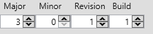

# Mod Baldur's Gate 3

## 📁 Structure du Mod

```
LoaneMod/
├── Localization/           # Fichiers de traduction
│   ├── English/
│   │   └── LoaneMod.loca.xml   # Textes en anglais
│   └── French/
│       └── LoaneMod.loca.xml   # Textes en français
├── Mods/
│   └── LoaneMod/
│       └── meta.lsx            # Métadonnées du mod (nom, auteur, UUID, etc.) / Données générales
├── Public/
│   └── LoaneMod/
│       ├── RootTemplates/
│       │   └── LoaneDice.lsx   # Template de l'objet (définition visuelle)
│       └── Stats/
│           └── Generated/
│               └── Data/
│                   └── My_stats.txt  # Statistiques et effets de l'objet
└── summon                      # Script pour invoquer l'objet en jeu
```

### Description des Fichiers

> [!tip]
>
> On peut facilement générer les UUID/H-UUID (UUID pour les traduction) à partir de BG3 MM
>
> 

### `Mods/LoaneMod/meta.lsx`

Contient les **métadonnées du mod** :

- **Author** : Nom de l'auteur
- **Name** : Nom affiché dans le gestionnaire de mods
- **UUID** : Identifiant unique du mod
- **Description** : Description du mod
- **Version64** : Version du mod - On peut générer la version avec BG3 Multitool (voir image ci-dessous)

    

### `Public/LoaneMod/RootTemplates/LoaneDice.lsx`

Définit le **template de l'objet** :

- **MapKey** : UUID unique de l'objet (`c8617f7c-63f0-4ff9-a0cb-448c15af9780`)
- **Name** : Nom interne (`OBJ_LoaneDice`)
- **ParentTemplateId** : Template parent dont hérite l'objet 
- **Stats** : Référence vers les statistiques de l'objet
- **DisplayName** / **Description** : Références vers les textes de localisation

### `Public/LoaneMod/Stats/Generated/Data/My_stats.txt`

Définit les **statistiques et effets** de l'objet :

- **Type** : `Armor` (catégorie d'équipement)
- **Rarity** : `Legendary`
- **Weight** : `0.5`
- **ValueOverride** : `10000` (valeur en or)
- **Boosts** : `+1` aux jets d'attaque, jets de sauvegarde et jets de compétence

### `Localization/*/LoaneMod.loca.xml`

Fichiers de **traduction** contenant les textes affichés en jeu :

- Nom de l'objet
- Description de l'objet

---

## Utilisation du Mod

### Installation

1. Packez le mod en `.pak` avec **BG3 Modder's Multitool** ou **lslib**
2. Placez le fichier `.pak` dans `%LocalAppData%\Larian Studios\Baldur's Gate 3\Mods`
3. Activez le mod dans le gestionnaire de mods ou avec **BG3 Mod Manager**

### Obtenir l'objet en jeu

Utilisez la console de debug avec la commande du fichier `summon` :

```lua
Osi.TemplateAddTo ("c8617f7c-63f0-4ff9-a0cb-448c15af9780", GetHostCharacter (), 1, 1)
```
